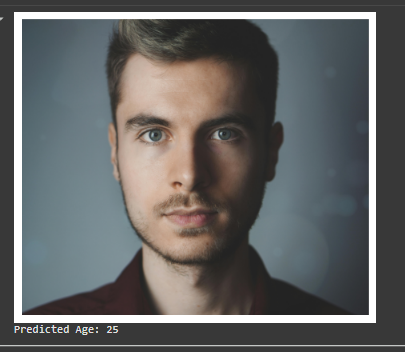
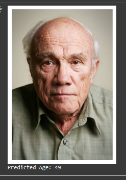

# Estimation de l'âge à partir d'une image (Google Colab)

## Description
Ce projet permet d'estimer l'âge d'une personne à partir d'une image en utilisant la librairie **DeepFace** et des modèles pré-entraînés de reconnaissance faciale. Il est conçu pour être utilisé facilement sur **Google Colab**.

Le principe est simple : 
1. L'utilisateur téléverse une image contenant un ou plusieurs visages.
2. Le système détecte les visages présents.
3. Un modèle de deep learning pré-entraîné estime l'âge de chaque visage.
4. L'âge prédit s'affiche dans la console et peut être visualisé directement sur l'image avec un encadré.

## Technologies utilisées
- Python 3
- Google Colab
- DeepFace (TensorFlow/Keras)
- OpenCV
- Matplotlib

## Instructions d'utilisation
1. Ouvrir le notebook sur **Google Colab**.
2. Exécuter les cellules dans l'ordre.
3. Téléverser une image contenant un visage lorsque demandé.
4. L'âge prédit s'affiche dans la console.

## Exemple

## Auteur
Salim4dev
