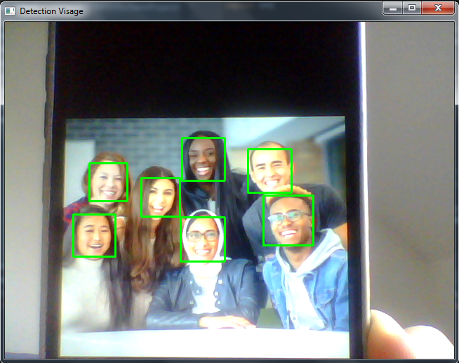

# Détection de Visages en Temps Réel

Ce projet utilise **OpenCV** et **Python** pour détecter des visages à partir de la caméra en temps réel. Il utilise un classificateur Haar pré-entraîné pour identifier les visages et les encadre avec des rectangles verts.

## Prérequis

- Python 3.x
- OpenCV (`opencv-python`)

Tu peux installer OpenCV avec :

```bash
pip install opencv-python
```
## Fonctionnement
- Capture le flux vidéo depuis la webcam.
- Convertit chaque image en niveaux de gris (nécessaire pour le détecteur Haar).
- Détecte les visages présents dans l’image.
- Dessine un rectangle vert autour de chaque visage détecté.
- Affiche le flux vidéo en temps réel avec les rectangles.

## Exemple

