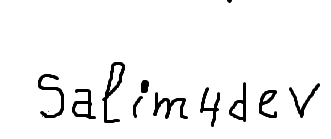
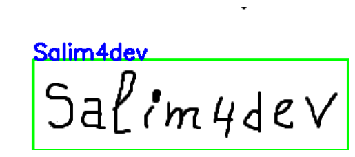
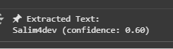

# Handwriting OCR - Google Colab Project

## Description
Ce projet est un notebook Google Colab qui permet d'extraire du texte à partir d'images manuscrites.  
Il utilise deux méthodes principales :
1. **Tesseract OCR** - Pour une reconnaissance basique de texte.
2. **EasyOCR** - Pour une meilleure reconnaissance de l'écriture manuscrite.

Le projet peut être exécuté directement sur Google Colab, sans configuration complexe.

## Fonctionnalités
- Chargement d’images depuis votre ordinateur.
- Extraction de texte depuis des images manuscrites.
- Affichage de l’image avec le texte reconnu et les boîtes englobantes.

## Instructions
1. Ouvrir `handwriting_ocr_colab.ipynb` sur [Google Colab](https://colab.research.google.com/).
2. Exécuter toutes les cellules.
3. Télécharger l’image manuscrite à analyser.
4. Observer le texte extrait et la visualisation avec boîtes englobantes.

## Requirements
- Google Colab
- Python 3
- Packages Python : pytesseract, easyocr, opencv-python, pillow, matplotlib

## Exemple
- Original

- Extraction

