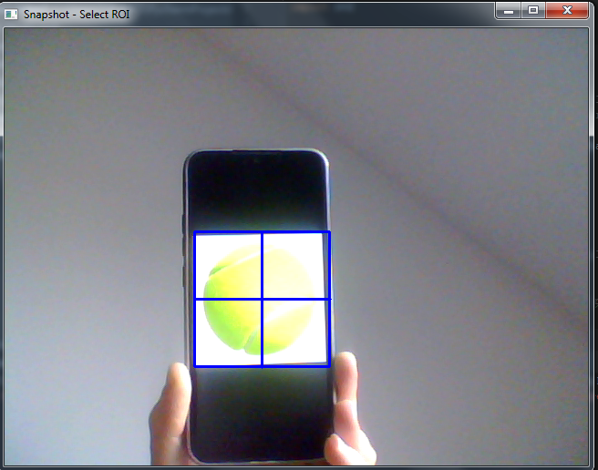
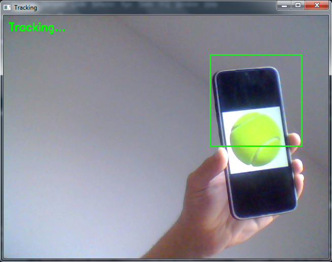
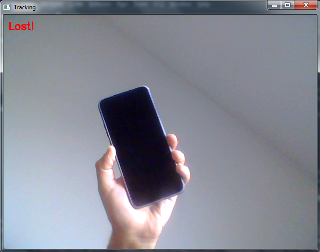

# Suivi d’Objet en Temps Réel

Ce projet utilise **OpenCV** et **Python** pour effectuer le suivi d’un objet sélectionné par l’utilisateur via la webcam en temps réel. Il utilise les trackers intégrés d’OpenCV (MOSSE, KCF, CSRT).

## Fonctionnalités

- Sélection interactive de l’objet à suivre (ROI) via la webcam.
- Suivi en temps réel avec différents algorithmes de tracking.
- Affichage du flux vidéo avec un rectangle autour de l’objet suivi.
- Indication si le suivi est perdu.

## Prérequis

- Python 3.x
- OpenCV (`opencv-python`)

Installation des dépendances :

```bash
pip install opencv-python
```
## Choix du tracker

- TrackerMOSSE_create() : rapide, recommandé pour Raspberry Pi.
- TrackerKCF_create() : plus précis mais plus lourd.
- TrackerCSRT_create() : très précis mais plus lent.

Tu peux changer le tracker dans le code selon tes besoins.

## Fonctionnement

- Capture un snapshot depuis la caméra.
- Permet de sélectionner manuellement la zone de l’objet à suivre.
- Relance le flux vidéo en temps réel.
- Met à jour la position de l’objet et affiche un rectangle autour.
- Affiche un message LOST§ si l’objet est perdu.

## Exemple
- Selection de l'objet à suivre

- Tracking

- Lost



